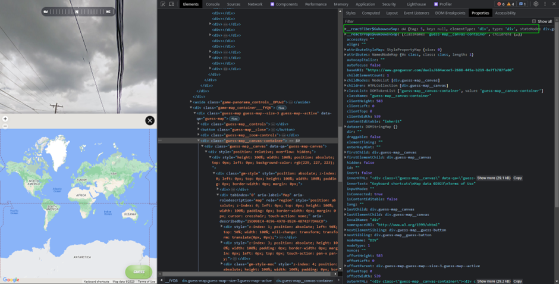
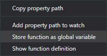
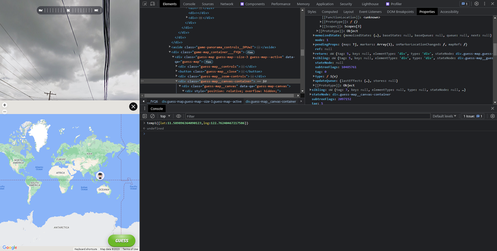

# How I developed the Geoguessr script
I only made this script to learn how to manipulate websites with userscripts so i'm sharing what i learnt.

I figured out all this on my own, so there is probably more efficient ways to do this and maybe some inaccurate info

## How I made the Duels Guesser feature

So, Geoguessr uses React for development and design of the website. React stores important information in variables
called “State” (https://react.dev/learn/state-a-components-memory).

Each element on a page is capable of having it’s own state. For example, the map element might have states holding the 
user’s guess location, etc.

It’s using this I can manipulate these states in my favour.

To see an element’s state, we can use developer tools and look for something interesting. “guess-map__canvas-container” 
sounds interesting so we can inspect it further


To view the React properties of an element, we can click it and open the “properties” tab in developer tools and look 
for a property starting with “reactFiber”



Now we can just look through the React Properties of this element. Anything interesting is usually under the “Return”
and “memoizedProps” headers.


Within the “memoizedProps” there are a couple of properties we can see that might interest us but let’s focus on 
“onMarkerLocationChanged”.

The developer tools tells us this is a function, we can even right click it to view its function definition 
– but this is no use to us since it’s all obfuscated.

From it’s name however, we can conclude that it has something to do with placing a marker on the map 
– the entire aim of Geoguessr. We can probably conclude this is going to be useful.

If we right click this function, we can store it as a “global variable” and test it to see what it does.



This saves it to the developer tool console, from which we can call it with the name ”temp1"


However, calling it does nothing.


We probably need to pass it some parameters for it to work.

Passing it an empty object "{}" will make it place a marker on the map, but it's just in the middle of the ocean...


But we can now conclude that it accepts an object.

Using some other code I wrote previously (which uses a similar method), I can get the coordinates from another element’s
react state. I know from this, the coordinates of the right answer are: 11.589896364090123, 122.76240467217586

We can try passing this into the function as an object.

An object needs “keys” which will uniquely be matched to its values (https://www.w3schools.com/js/js_objects.asp)

The keys we will pass will need to match the keys the function is expecting. Since we are dealing with a pair of
coordinates, we can place a safe bet on these keys being called something similar to “lat” and “lng” – for latitude and longitude.

Written out, this leaves us with the following function call:


And it was that easy... now we have the marker placed on the correct location in Geoguessr Duels.



We can just press guess now, and get the location correct.


### Putting this into code:

```js
const element = document.getElementsByClassName("guess-map__canvas-container")[0] 
const keys = Object.keys(element)
const key = keys.find(key => key.startsWith("__reactFiber$")) 
const place = element[key].return.memoizedProps.onMarkerLocationChanged
place({lat: lat, lng: lng})
```

The first line is identifying the HTML element containing the props I’m looking for,
this is technically an array of elements matching the class name `guess-map__canvas-container`,
but we’re only interested in the first, so put a [0].

Object.keys() will find all the keys of the html element and stores them in the variable `keys`

From these keys we can identify the key we’re looking for by searching for the one starting with `__reactFiber$`.

Then I just go through the properties until I find the function mentioned earlier, “onMarkerLocationChanged” and save this function as a variable “place”.

Finally, I can just call this function with the lat and lng values identified previous by doing `place({lat: lat, lng: lng})`
where `lat` and `lng` are defined variables containing the latitude and longitude coordinates for the correct answer.
